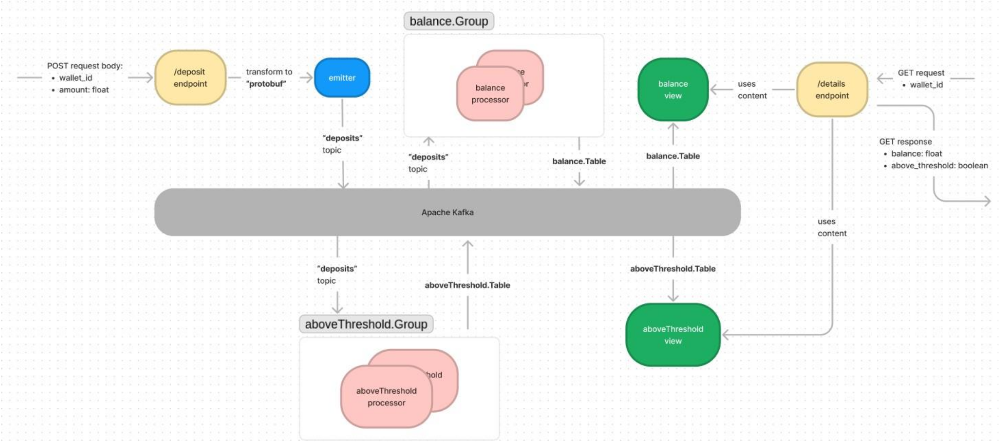
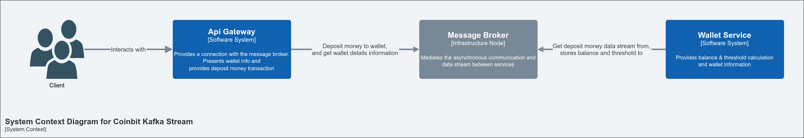

# Coinbit Kafka Stream

# Contents
1. [Problem Statement](#problem-statement)
2. [Objective](#objective)
3. [System Architecture](#system-architecture)
4. [Run](#run)
   * [Prerequisite](#prerequisite)
   * [Deploy](#deploy)
5. [Stop](#stop)
6. [Test](#test)
   * [Test Case 1](#test-case-1)
   * [Test Case 2](#test-case-2)
   * [Test Case 3](#test-case-3)
   * [Test Case 4](#test-case-4)

# Problem Statement
Make a service where user can deposit money into their wallet and fetch their current balance using Event-driven architecture design.

**Required implementations:**
1. `HTTP POST` endpoint for user to deposit money with this payload:
	```bash
	{
		"wallet_id": "string",
		"amount": float
	}
	```
2. `HTTP GET` endpoint to get the balance of the wallet, and also a flag whether the wallet has ever done one or more deposits with amounts more than **10,000** within a single **2-minute** window (rolling-period). The endpoint should return this response:
	```bash
	{
		"wallet_id": "string",
		"balance": float,
		"above_threshold": boolean
	}
	```

**Test Cases:**
1. **True** if two deposits of 6,000 amount each, both within 2 minutes.
2. **False** if one single deposit of 6,000, then after 2-minutes later another single deposit of 6,000.
3. **False** if five deposits of 2,000 amount each all within 2 minutes, then after 5 seconds later another single deposit of 6,000.
4. **True** if six deposits of 2,000 amount each all within 2 minutes.

# Objective
- [X] Develop the service to solve problem statement using [Go](https://golang.org/doc/install).
- [X] Use [Goka](https://github.com/lovoo/goka) to build the service as mentioned on problem statement section.
- [X] Use [Protobuf](https://developers.google.com/protocol-buffers/docs/gotutorial) when encoding/decoding payload to/from Kafka broker.

**High-Level Diagram using Goka:**


# System Architecture


# Run
## Prerequisite
1.  Please make sure you have [Go](https://golang.org/doc/install) installed on your system.
2.  Please make sure you have [Docker](https://docs.docker.com/engine/install/) installed on your system.
3.  Please make sure you have [Docker Compose](https://docs.docker.com/compose/install/) installed on your system.
## Deploy
1. Clone this repository and change directory to the root of cloned project folder.
```bash
git clone https://github.com/mushoffa/coinbit-kafka-stream-go.git
```
2. Ensure content of the root project folder is as follow.
```bash
/coinbit-kafka-stream-go$ ls
.
├── api-gateway
├── docker-compose-cluster.yml
├── docker-compose.yml
├── docker-kafka-single.yml
├── docs
├── Makefile
├── README.md
└── wallet-service
``` 
3. Run the command `make docker-run` on terminal to run all the services in docker container.

```bash
/coinbit-kafka-stream-go$ make docker-run
Creating coinbit-zookeeper ... done
Creating coinbit-broker    ... done
Creating coinbit-api-gateway    ... done
Creating coinbit-wallet-service ... done
```
4. Run the command `docker ps | grep coinbit` to verify all required docker container services are up and running.
```bash
/coinbit-kafka-stream-go$ docker ps | grep coinbit
8f75e79b1891   coinbit-kafka-stream-go_api-gateway      "./api-gateway"          2 minutes ago   Up 2 minutes           0.0.0.0:9091->9091/tcp, :::9091->9091/tcp                                                           coinbit-api-gateway
7be150af03d9   coinbit-kafka-stream-go_wallet-service   "./wallet-service"       2 minutes ago   Up 2 minutes                                                                                                               coinbit-wallet-service
59d016644c32   confluentinc/cp-kafka:7.0.1              "/etc/confluent/dock…"   2 minutes ago   Up 2 minutes           0.0.0.0:9092->9092/tcp, :::9092->9092/tcp, 0.0.0.0:19092->19092/tcp, :::19092->19092/tcp            coinbit-broker
f4eedb121bc2   confluentinc/cp-zookeeper:7.0.1          "/etc/confluent/dock…"   2 minutes ago   Up 2 minutes           2181/tcp, 2888/tcp, 3888/tcp                                                                        coinbit-zookeeper

```

# Stop
Run the command `make docker-stop` on terminal to stop all the running services in docker container.
```bash
/coinbit-kafka-stream-go$ make docker-stop
docker-compose down
Stopping coinbit-api-gateway    ... done
Stopping coinbit-wallet-service ... done
Stopping coinbit-broker         ... done
Stopping coinbit-zookeeper      ... done
Removing coinbit-api-gateway    ... done
Removing coinbit-wallet-service ... done
Removing coinbit-broker         ... done
Removing coinbit-zookeeper      ... done
Removing network coinbit-kafka-stream-go_kafka-stream
```

# Test
Please ensure you have all required docker container services are up and running, then can use eirther [postman collection](docs/postman_collection.json) or curl to hit the API.

Deposit API
```bash
curl --location --request POST 'localhost:9091/wallet/deposit' \
--header 'Content-Type: application/json' \
--data-raw '{
    "wallet_id": "12345",
    "amount": 6000
}'
```

Details API
```bash
curl --location --request GET 'localhost:9091/wallet/details/12345' \
```
## Test Case 1
The value of `above_threshold` field is **True** if two deposits of 6,000 amount each, both within 2 minutes.<br/>
Please refer to [Test Case 1](docs/test/test_case_1/) folder for output result in the format of screenshot on postman http operation.

## Test Case 2
The value of `above_threshold` field is **False** if one single deposit of 6,000, then after 2-minutes later another single deposit of 6,000.<br/>
Please refer to [Test Case 2](docs/test/test_case_2/) folder for output result in the format of screenshot on postman http operation.

## Test Case 3
The value of `above_threshold` field is **False** if five deposits of 2,000 amount each all within 2 minutes, then after 5 seconds later another single deposit of 6,000.<br/>
Please refer to [Test Case 3](docs/test/test_case_3/) folder for output result in the format of screenshot on postman http operation.

## Test Case 4
The value of `above_threshold` field is **True** if six deposits of 2,000 amount each all within 2 minutes.<br/>
Please refer to [Test Case 4](docs/test/test_case_4/) folder for output result in the format of screenshot on postman http operation.